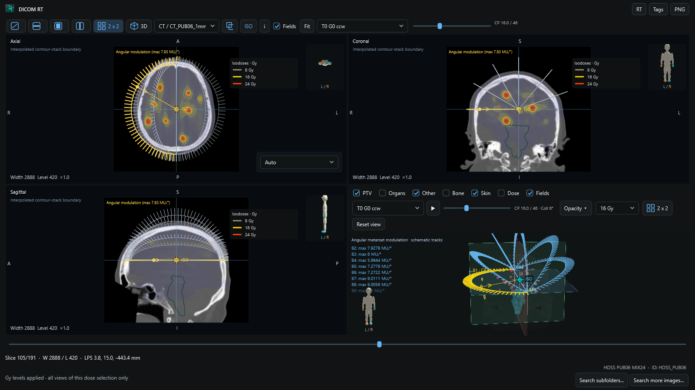
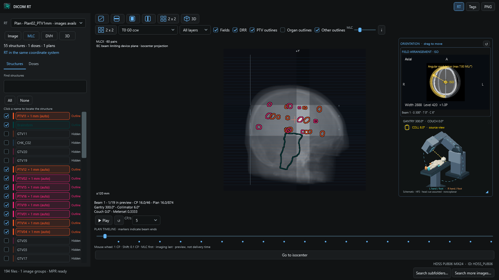
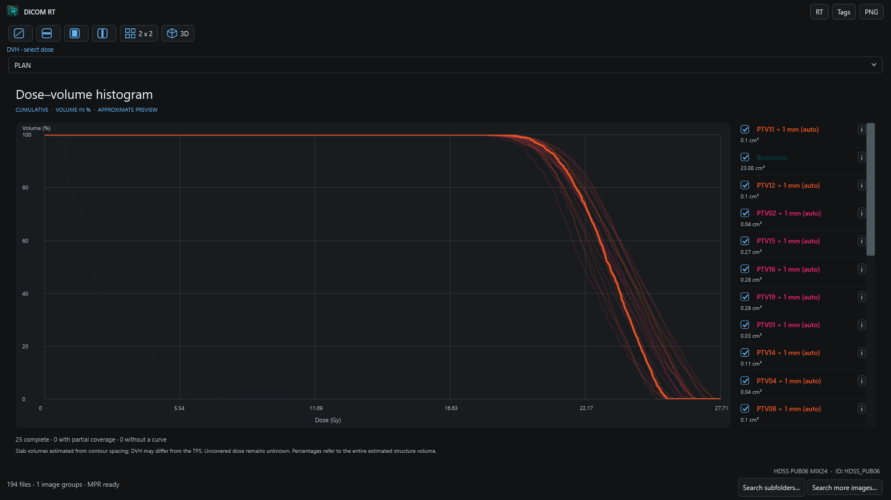

# DICOM RT for QuickLook

**Version 0.2.24** brings local DICOM image, radiotherapy and metadata previews to QuickLook on Windows. Select a DICOM file in Explorer and press **Space**. Images open first; plans, structures and doses become available while scanning continues. Opening an RTPLAN goes directly to MLC, while RTSTRUCT and RTDOSE open 3D. These RT workspaces also work without a CT series; MLC does not require a dose.

Source files remain unchanged. This is a research and inspection tool, not a clinically validated treatment-planning system.

[Download Windows installer](https://github.com/Kiragroh/QuickLook-DicomRT/releases/latest/download/QuickLook-DicomRT-Setup-0.2.24.exe) · [Open the presentation](https://kiragroh.github.io/QuickLook-DicomRT/) · [Watch the 30-second announcement](https://github.com/Kiragroh/QuickLook-DicomRT/releases/download/v0.2.20/QuickLook-DicomRT-Announcement-30s-0.2.20.mp4)



**Select a file. Press Space. Inspect the RT context.** The linked 2 × 2 workspace combines axial, coronal and sagittal images with 3D anatomy and the active field. All screenshots and clips below are fresh captures from version 0.2.20 using the approved public nonpatient multimets benchmark.

[Download the single-file HTML tour](https://github.com/Kiragroh/QuickLook-DicomRT/releases/download/v0.2.21/QuickLook-DicomRT-Feature-Tour-0.2.21-Standalone.html) for offline viewing or portal uploads. Screenshots, chapter clips and the 30-second film with original upbeat music are embedded; no companion folders are needed. GitHub and download links require connectivity. [Feature changelog](CHANGELOG.md).

Images now start with the **DICOM** window preset, using the stored window center and width. Auto remains selectable and is used as fallback when stored values are absent. To update another Windows PC, run the installer for the new version; an older installer does not download updates.

## What you can inspect

| Workflow | What is available |
|---|---|
| Images + RT | Linked crosshair, native/MPR views, zoom, window presets, contours, colorwash and editable isodoses |
| Fields + MLC | Synchronized field selection and CP timeline; play/pause; true aperture; collimator rotation; CT-derived DRR; projected PTV/organ/other outlines |
| 3D | Shared mesh cache across full 3D and 2 × 2; additive structures; transparent skin; isocenter; field paths and moving aperture |
| DVH | Click a curve or structure name to focus it; hover a curve for its name, volume and dose metrics; export active curves with or without metrics |
| DICOM tags | Search retained text across nested sequences; double-click to copy a tag, label or value; keep the selected entry when clearing search |
| Independent RT | Inspect a plan's MLC without CT or dose; select individual doses and structure sets without a plan |
| Discovery | Clearly labeled image availability; Search more images on demand; repeatable Search subfolders for additional RT |
| Plan sums | Explicit compatible groups, selectable contributing plans, Generate sum, included-plan labels and Dmax navigation |
| Export + help | Whole-viewer PNG or individual view export, patient/plan-aware names, grouped shortcut tables in Info / F1 |

## See what is switched on



The MLC structure list highlights effective outlines in their own contour colors. **Outline**, **Group off**, **Hidden** and **No match** explain the combined category and individual-checkbox state. Uncheck one PTV to remove only that outline. DRR and leaf opacity are independently adjustable.



Click directly on a DVH curve to emphasize it and reveal its structure in the list. Click again to restore all curves. Hover the line for its name, volume, Dmean, Dmedian, Dmax, Dmin, D98 and D2. Selection and hover reuse the calculated curve; they do not recalculate the DVH. The app and installer now share the same blue icon and accent.

DVH exports optionally include Dmean, Dmedian, Dmax, Dmin, D98 and D2. Numbers use up to four decimal places; a curves-only export keeps downstream import simple.

Arc modulation uses radial ticks again, now covering each original control-point interval at no more than one-degree visual spacing. Tick length maps linearly to MU/degree; original interval values and delivery control points remain unchanged. Other fields stay muted and the active field/aperture is yellow.

## Built around responsive inspection

- RT objects are discovered with priority. Image opening prefers a matching plan; opening an RT file retains that exact object.
- Other image series retain lightweight identities until needed. **Search more images** uses known matching paths directly, or searches a selected folder. Large directories still require enumeration and metadata reads.
- DRRs, projected outlines and 3D surfaces are prepared in the background and reused. Additional 3D structures arrive incrementally, without discarding the existing scene.
- Full 3D and 2 × 2 share their camera, settings and prepared meshes. Outline-list indicators update in place, outside control-point playback.
- These are design and engineering checks, not a universal latency guarantee. The edited 30-second video demonstrates features rather than measured loading or playback speed.

## Workspace features

- **Compact controls:** one horizontal image toolbar with view icons (including standalone 3D), and one MLC settings row. Narrow windows retain controls through horizontal scrolling. Hover tooltips explain buttons; the info button includes developer links and shortcuts.
- **Anatomy without pauses:** PTV, organ and other outlines warm before their toggles are enabled. Completed individual outlines appear incrementally, obsolete foreground work is canceled, and the mesh cache retains larger ROI sets. Background preparation uses bounded viewer-local memory and stops on closing the preview.
- **MLC contrast:** adjust leaf/jaw opacity over the optional DRR, from translucent to dark. Wheel detents move 1 CP; Shift gives 0.1 CP, and the slider stays continuous.
- **Clear field geometry:** fixed fields retain true joint jaw/MLC aperture intersections, with incoming direction arrows. Moving gantries show projected source tracks instead of leaf intersections; ticks on the selected track represent angular meterset modulation (MU per degree). The track radius is schematic, not physical source distance. Missing meterset data remain unknown; this is angular modulation, not measured temporal dose rate. SETUP/CBCT fields require explicit selection. Choose **All fields - no highlight** for an equal gray overview.
- **Stable crosshair and contours:** left-drag crosshair movement keeps the in-plane viewport fixed. Fractional parallel MPR planes retain their nearest contour slab within local half-spacing, while gaps remain empty. Native view returns to the crosshair slice. Switching plans loads an unambiguously referenced compatible planning series when the current image frame cannot be mapped to the new plan.
- **Windowing:** Auto starts by default; DICOM, Soft tissue, Lung, Bone, Brain and Liver presets are available. Custom reveals a sampled histogram with draggable upper/lower window limits.
- **Compact DVH:** structure names and small volume labels remain visible; the info hover shows coverage, sampling and Dmean, Dmedian, Dmax, Dmin, D98 and D2. CSV export includes every enabled structure and these metrics. Metrics are approximate; full-structure summaries remain unavailable with partial dose coverage.
- **Save any view:** right-click Native, Axial, Coronal, Sagittal, 3D, DVH or MLC to save a PNG, including individual 2x2 tiles. DVH additionally offers a full chart and active-curve CSV. **Ctrl+Shift+S** saves the entire viewer, including open sidebars. **Ctrl+1..6** changes image view; **Ctrl+I** jumps to ISO; **F1** opens help.

The DRR is a HU-derived display projection, not a calibrated treatment image. It requires a CT association, recorded source-axis distance and patient position, and a rigid frame mapping. Unsupported gantry pitch, table pitch/roll or eccentric rotation disables anatomical projection while the aperture preview remains available. Projected ROI boundaries use the existing approximate contour-derived surfaces.

## Install

Install and start [QuickLook for Windows](https://github.com/QL-Win/QuickLook) first. The plugin was developed against QuickLook 4.5 and targets .NET Framework 4.6.2; the .NET Framework 4.8 runtime is required. Direct3D 11 provides the main 3D renderer. QuickLook is a separate dependency and is not bundled.

Download **QuickLook-DicomRT-Setup-0.2.24.exe** from Releases and choose **Install / Update**. The per-user installer verifies its embedded package, backs up the existing DICOM RT folder, updates only this plugin and restarts QuickLook. It supports a normal desktop QuickLook installation; portable and Microsoft Store hosts receive manual-package guidance. The installer is not code-signed.

For manual installation, download `QuickLook.Plugin.DicomRT-0.2.20.qlplugin`, select it in Explorer while QuickLook is running, press **Space**, choose **Install**, and restart QuickLook. This follows the [QuickLook plugin installation procedure](https://github.com/QL-Win/QuickLook/wiki/Available-Plugins#how-to-install-or-upgrade-a-plugin). Existing unrelated plugins do not need to be removed.

## Explore a dataset

- **RT** opens the left sidebar: plan selection, plan sum, structures, dose controls, and **Image / MLC / DVH / 3D** views. **Tags** opens the right sidebar. Both start closed for image files; RT files open the RT sidebar.
- **Image:** scroll with the wheel or native-slice slider; click to place the crosshair. Right-drag adjusts window/level. Use **Soft tissue**, **Bone**, **Auto**, zoom buttons and **Fit**. Native, axial, coronal, sagittal and **MPR + 3D** views become available when suitable volume geometry has loaded. The **MPR + 3D** view uses a 2 × 2 grid with linked axial, coronal and sagittal images plus a compact 3D view. Its coordinate planes follow slice navigation without rebuilding the cached structure surfaces. A shared human orientation badge uses turquoise for the patient's left hand and foot and orange for the right; the 3D badge follows the camera orbit.
- **Image fusion:** select the base series above the image. The overlapping-squares button opens a registered overlay selector and blend control. Only suitable series with an unambiguous spatial association are offered. Registered series changes preserve the physical focus.
- **Structures:** filter by name, show/hide ROIs or use **All / None**. Click a name to locate the structure.
- **Dose:** show/hide individual objects. Colorwash and isodoses are independent; adjust opacity and colorwash thresholds. Physical doses start with more evenly spaced absolute isodoses in whole Gy (e.g. 2, 4, …, 26 Gy for a 27.7 Gy maximum). Edit up to 24 levels with at most two decimal places, separated by semicolons. Choose **Gy** for absolute levels or **%** for percentages of each dose maximum. **Apply** keeps Gy edits local to this dose selection in the current viewer. **Apply globally** saves percentage levels for other relative views and future files. **Default** restores automatic whole-Gy levels locally, or the standard 10–100% list globally. Legacy global Gy settings are ignored. The Dose panel and image show a color legend; click a swatch to change a line color. The 3D dose selector uses the same levels and colors. Relative/nonphysical doses remain explicitly percentage-based. Colorwash thresholds remain percentages of each grid maximum.
- **MLC:** inspect a large aperture view, select a beam, or scrub the whole-plan timeline. MLC treatment fields come first, other treatment fields next, and SETUP/PORTFILM imaging fields last. Original beam numbers remain visible. Markers indicate beam ends. Interpolation stays within each beam; speed is in control points per second, not actual delivery time. Independent dual layers, including the observed `MLCX1` / `MLCX2` vendor encoding, can be overlaid or selected separately. Coordinates use the IEC beam-limiting-device plane projected to isocenter. A synchronized linac/couch schematic follows gantry and patient-support angles, with a dashed yellow beam axis through isocenter. A permanent gold collimator dial shows the angle and rotation from the source view and follows interpolated control points. The table ends at the schematic head. Its normalized human figure uses the beam's referenced patient setup `PatientPosition` and the same left/right colors as the image badges. A body-region cue uses available metadata, or an explicitly labeled head/chest assumption. The figure has no anatomical registration; unsupported or missing patient positions are indicated.
- **DVH:** choose a dose and calculate visible structures on demand, including dose-plus-structures data without a plan or image. Curves use 2,048 dose intervals with linear display interpolation. Click an ROI name or row to emphasize its curve; click again to restore all curves. Checkboxes control visibility independently; the left structure list supports the same focus interaction. Results are reused for unchanged ROI, dose and transform. Partial curves are dashed and remain lower bounds rather than appearing complete.
- **3D:** drag to rotate and scroll to zoom. Only DICOM **PTV** structures are enabled initially. Separate **Organs** and **Other** checkboxes start off. SUPPORT and EXTERNAL contours are excluded, including from focus. Names do not substitute for missing target/organ types. CT skin is enabled by default at **6% opacity**, with a separate **Skin opacity** control; bone and dose are explicit options. ROI opacity is independent, and large enclosing organs are made more transparent to expose targets. Adjust the isodose level separately. Click a structure name to center and highlight it; click again to clear the highlight. Direct3D 11 depth peeling keeps skin and nested structures transparent. Full-detail GPU buffers remain unchanged during orbit, zoom and MPR scrolling. Surface preparation starts in the background as image/RT objects become available. Full 3D and the 2×2 MPR layout use the same 3D control, settings, camera and prepared mesh cache; leaving the view does not discard it. Both layouts expose the same controls. A camera-projected ISO cross remains visible through surfaces while the physical isocenter cross stays in the 3D scene. ROI reconstruction targets 0.5 mm for small objects and 1 mm otherwise, with explicitly bounded larger-object spacing and 0.65 mm maximum smoothing displacement. Large first-time scenes take longer to prepare; subsequent camera motion reuses their buffers. A renderer initialization failure is labeled as a WPF fallback. CT threshold and voxelized contour surfaces are bounded approximations; unsupported contours fall back to lines when possible.

## Search all nested metadata

**Ctrl + wheel** zooms while retaining the current viewport. Compact in-image width/level sliders adjust contrast and brightness. The gold **ISO** cross marks a plan isocenter; an off-plane projection is dotted and includes its signed distance. Contours coplanar with the displayed native slice retain their original points. Off-axis native and reformatted planes show an explicitly labeled approximate contour-stack boundary between supported contour planes, with actual plane intersections as a fallback for unsupported stacks.

The tag tree includes every parsed metadata element and nested sequence item. Sequences start collapsed. Search matches tag number, dictionary name, VR, sequence path and displayed value across the full tree; matching ancestors expand automatically. Clearing search retains the selected result, opens its ancestor path and scrolls it into view; unrelated manual expansion remains intact. Double-click a tag to open separate selectable Tag number, Label and Value fields with Copy buttons. MPR displays tags from the native source file.

Large text values are capped at **8,192 characters**, with an explicit truncation marker. Search covers only the retained prefix of those values. Pixel and other binary payload contents are omitted and are not searched. This value limit does not truncate the sequence hierarchy.

## Plan sum

**Σ Plan sum** is offered only when more than one dose is available. A sum is never selected automatically, including when opening a dose without its plan. Choose it to add eligible physical Gy doses of type `PLAN`. Each referenced plan must have one unambiguous plan dose. Repeated SOP instances, ambiguous alternatives, `BEAM`/`FRACTION`/`MULTI_PLAN` doses, relative/nonphysical dose, mismatched known patients, and missing or nonrigid mappings are excluded and counted.

Sources are sampled in physical space on the first suitable regular reference dose grid. Its extent and resolution stay unchanged. A point receives a sum only when every included source covers it; otherwise it remains unknown (`NaN`). Coverage refers to reference grid points. No automatic fraction scaling, biological conversion or DICOM export occurs. Included-plan structures remain available. View the sum in Image, DVH and 3D; MLC is disabled for a sum.

## Performance and limits

The selected image precedes indexing. A filename-independent short header pass prioritizes RT and REG; the remaining folder is still read. Completed frames stay visible until a new frame and its labels are ready. Work is cancelable, native decoding uses at most two workers, the neighboring-slice cache is limited to 32 MiB, and an MPR intensity volume is limited to 512 MiB. Only the containing folder is scanned. There is no persistent patient cache or PACS connection.

Previously recorded measurements on the supplied 194-file public nonpatient benchmark prepared the initial CT at **31 ms**, made the first plan available at **1.45 s**, and completed indexing at **2.20 s**, using a fresh viewer with warm OS caches. These are historical observations, not a new 0.2.3 measurement. The image metric is recorded before redraw: it measures decoding/preparation, not screen visibility. The observations exclude QuickLook startup and are not latency guarantees. See [VERIFICATION.md](VERIFICATION.md).

- Supported intensity paths are uncompressed monochrome integer images and suitable CT/MR stacks. RTSTRUCT, RTDOSE, conventional RTPLAN and spatial REG are supported. Final REG inference uses the complete patient-filtered catalog, including exact image references.
- Compressed/color intensity decoding, Modality LUT, enhanced multiframe intensity transforms/MPR and deformable registration are not implemented. Names or folder proximity never substitute for registration.
- Coplanar native structures retain original contours; off-axis native and reformat boundaries interpolate supported parallel contour stacks and are approximate. 3D uses contour voxelization and CT thresholds, adaptive detail and unavailable-object counts. Transparency can show sorting artifacts. Scene limits are 8,000,000 triangles, 1,000,000 triangles per object, 64 ROI inputs and 8 dose inputs. Fine grids are bounded at 256 samples per axis.
- DVH uses contour slabs, half-spacing end caps, adaptive sampling and 2,048 dose intervals with linear display interpolation. Limits are **128 structures**, **600,000 candidate cells per ROI**, **10 seconds per ROI**, and **30 seconds per view**. Unprocessed structures are counted. Single-plane/nonparallel contours and nonrigid DVH mappings are unsupported. Results are not claimed to match a TPS.
- Earlier public-benchmark checks produced complete DVH curves for **all 55 ROIs**, each with full dose coverage, and retained all 55 ROIs plus dose and CT context in the former 3D budget workload. These historical results do not measure the 0.2.2 display selection, which excludes EXTERNAL contours. Demo views may select fewer structures for legibility.
- Physical dose addition is not a treatment evaluation. MLC playback is not a validated machine or delivery simulator.

## Build and test

Use Windows, a .NET SDK, a compatible .NET Framework runtime, and an installed QuickLook host. NuGet supplies build-time reference assemblies. `QuickLook.Common.dll` comes from the host and is not redistributed.

`Plugin/Plugin.csproj` defaults `QuickLookDir` to `%LOCALAPPDATA%\Programs\QuickLook`. Override it for another installation:

```powershell
dotnet build Plugin -c Release -p:QuickLookDir="C:\Tools\QuickLook"
dotnet run --project Core.Tests -c Release
dotnet run --project Rt.Tests -c Release
dotnet run --project Render.Tests -c Release
dotnet run --project Playback.Tests -c Release
dotnet run --project Dvh.Tests -c Release
dotnet run --project ThreeD.Tests -c Release
dotnet run --project Interaction.Tests -c Release
```

Create the manual package with `./scripts/Package.ps1`. For a nondefault host location, set `$env:QuickLookDir` before running the script. Output goes into ignored `artifacts/`.

Optional read-only checks emit aggregate results without patient names, identifiers or paths:

```powershell
./Core.Tests/bin/Release/net462/Core.Tests.exe --accept <authorized-folder>
./Rt.Tests/bin/Release/net462/Rt.Tests.exe --private <authorized-folder>
./Render.Tests/bin/Release/net462/Render.Tests.exe --benchmark <authorized-folder>
./Dvh.Tests/bin/Release/net462/Dvh.Tests.exe --private <authorized-folder>
./ThreeD.Tests/bin/Release/net462/ThreeD.Tests.exe --scene-budget <authorized-folder>
```

`scripts/CreateSynthetic.py` creates a synthetic CT/MR/RT/REG example. `Harness <file> --verify` loads the same WPF control in an offscreen test window and exits after verification. This does not replace interactive acceptance in QuickLook.

Synthetic fixtures are for tests only. The 0.2.20 presentation and 30-second HyperFrames announcement film use only the approved public nonpatient multi-metastasis benchmark. The current tour opens with a real four-view capture. Earlier GPT Image conceptual artwork never substitutes for anatomy or viewer screenshots. The edited film demonstrates features rather than measured interaction latency. This case has no MR/REG, dual-layer MLC or multiple-plan demonstration. `Rt.Tests --private-mlc <authorized-folder>` provides aggregate-only dual-layer acceptance.

## Reuse and contribute

Core geometry, RT interpretation and WPF presentation are separate projects; see [API_CONTRACT.md](API_CONTRACT.md). Use synthetic reference cases for geometry, registration, dose and MLC changes. Contributions must not include private DICOMs, identifiers, paths or patient screenshots.

This is an independent C# implementation. DICOM Browser was a feature reference; no Rust code or binaries from it are included. See [dependency notices](THIRD_PARTY.md) and [generated icon provenance](assets/README.md).

### Export and arc display (0.2.20)

Exports include Patient ID and the relevant Plan ID in the filename; PNGs and detailed DVH tables carry them inside the export too. DVH CSV offers a complete table with metrics or a four-column curves-only format, both with at most four decimal places.

Image and 3D arc guides show angular meterset modulation (e.g. MU/°). Angular weights are not measured delivery rates. Enable **Fields** in 3D to see all treatment tracks without rebuilding structures. Select a field and use the CP slider or mouse wheel: a small MLC BEV follows the active marker and updates the actual leaf/jaw opening, including multiple layers. Beam and CP selection are shared with MLC, images and the 2 × 2 view.
