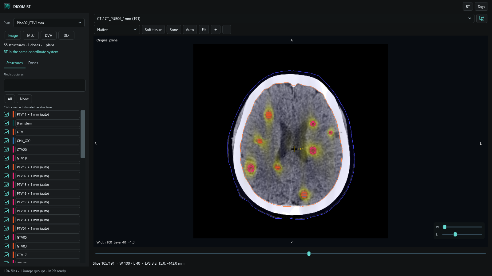

# DICOM RT for QuickLook

**Version 0.2.1** brings local DICOM image, radiotherapy and metadata previews to QuickLook on Windows. Select a DICOM file in Explorer and press **Space**. Images open first; plans, structures and doses become available while scanning continues. Opening an RTPLAN goes directly to MLC, while RTSTRUCT and RTDOSE open 3D. These RT workspaces also work without a CT series; MLC does not require a dose.

Source files remain unchanged. This is a research and inspection tool, not a clinically validated treatment-planning system.

[Download Windows installer](https://github.com/Kiragroh/QuickLook-DicomRT/releases/latest/download/QuickLook-DicomRT-Setup-0.2.1.exe) · [Release and offline HTML tour](https://github.com/Kiragroh/QuickLook-DicomRT/releases/tag/v0.2.1)



## Install

Install and start [QuickLook for Windows](https://github.com/QL-Win/QuickLook) first. The plugin was developed against QuickLook 4.5 and targets .NET Framework 4.6.2; a compatible .NET Framework runtime is required. QuickLook is a separate dependency and is not bundled.

Download **QuickLook-DicomRT-Setup-0.2.1.exe** from Releases and choose **Install / Update**. The per-user installer verifies its embedded package, backs up the existing DICOM RT folder, updates only this plugin and restarts QuickLook. It supports a normal desktop QuickLook installation; portable and Microsoft Store hosts receive manual-package guidance. The installer is not code-signed.

For manual installation, download `QuickLook.Plugin.DicomRT-0.2.1.qlplugin`, select it in Explorer while QuickLook is running, press **Space**, choose **Install**, and restart QuickLook. This follows the [QuickLook plugin installation procedure](https://github.com/QL-Win/QuickLook/wiki/Available-Plugins#how-to-install-or-upgrade-a-plugin). Existing unrelated plugins do not need to be removed.

## Explore a dataset

- **RT** opens the left sidebar: plan selection, plan sum, structures, dose controls, and **Image / MLC / DVH / 3D** views. **Tags** opens the right sidebar. Both start closed for image files; RT files open the RT sidebar.
- **Image:** scroll with the wheel or native-slice slider; click to place the crosshair. Right-drag adjusts window/level. Use **Soft tissue**, **Bone**, **Auto**, zoom buttons and **Fit**. Native, axial, coronal, sagittal and **3 planes** views become available when suitable volume geometry has loaded. The **3 planes** view uses a 2 × 2 grid with linked axial, coronal and sagittal images plus a compact 3D view. Its coordinate planes follow slice navigation without rebuilding the cached structure surfaces.
- **Image fusion:** select the base series above the image. The overlapping-squares button opens a registered overlay selector and blend control. Only suitable series with an unambiguous spatial association are offered. Registered series changes preserve the physical focus.
- **Structures:** filter by name, show/hide ROIs or use **All / None**. Click a name to locate the structure.
- **Dose:** show/hide individual objects. Colorwash and isodoses are independent; adjust opacity and colorwash thresholds. Enter up to twelve isodose levels greater than 0 and at most 100 percent of each dose maximum, separated by semicolons, using a decimal point. Relative dose remains labeled as relative.
- **MLC:** inspect a large aperture view, select a beam, or scrub the whole-plan timeline. Markers indicate beam ends. Interpolation stays within each beam; speed is in control points per second, not actual delivery time. Independent dual layers, including the observed `MLCX1` / `MLCX2` vendor encoding, can be overlaid or selected separately. Coordinates use the IEC beam-limiting-device plane projected to isocenter. A synchronized mini linac/couch schematic follows gantry and patient-support angles; its patient glyph has no patient registration.
- **DVH:** choose a dose and calculate visible structures on demand, including dose-plus-structures data without a plan or image. Curves use 2,048 dose intervals with linear display interpolation. Click an ROI name or row to emphasize its curve; click again to restore all curves. Checkboxes control visibility independently; the left structure list supports the same focus interaction. Results are reused for unchanged ROI, dose and transform. Partial curves are dashed and remain lower bounds rather than appearing complete.
- **3D:** drag to rotate and scroll to zoom. DICOM interpreted types **PTV / ORGAN** are selected by default; **All ROI types**, bone, skin and dose are explicit options. Names do not substitute for missing interpreted types. Adjust opacity and isodose level. The mesh smoothing step is bounded to 1 mm displacement (not the total reconstruction error); unchanged geometry reuses cached meshes. CT threshold and voxelized contour surfaces are bounded approximations; unsupported contours fall back to lines when possible.

## Search all nested metadata

**Ctrl + wheel** zooms while retaining the current viewport. Compact in-image width/level sliders adjust contrast and brightness. The gold **ISO** cross marks a plan isocenter; an off-plane projection is dotted and includes its signed distance. Native contours are unchanged. Reformatted planes show an explicitly labeled approximate contour-stack boundary between supported contour planes, with actual plane intersections as a fallback for unsupported stacks.

The tag tree includes every parsed metadata element and nested sequence item. Sequences start collapsed. Search matches tag number, dictionary name, VR, sequence path and displayed value across the full tree; matching ancestors expand automatically. Clearing search restores manual expansion state. MPR displays tags from the native source file.

Large text values are capped at **8,192 characters**, with an explicit truncation marker. Search covers only the retained prefix of those values. Pixel and other binary payload contents are omitted and are not searched. This value limit does not truncate the sequence hierarchy.

## Plan sum

A sum is never selected automatically, including when opening a dose without its plan. Choose **Σ Plan sum** to add eligible physical Gy doses of type `PLAN`. Each referenced plan must have one unambiguous plan dose. Repeated SOP instances, ambiguous alternatives, `BEAM`/`FRACTION`/`MULTI_PLAN` doses, relative/nonphysical dose, mismatched known patients, and missing or nonrigid mappings are excluded and counted.

Sources are sampled in physical space on the first suitable regular reference dose grid. Its extent and resolution stay unchanged. A point receives a sum only when every included source covers it; otherwise it remains unknown (`NaN`). Coverage refers to reference grid points. No automatic fraction scaling, biological conversion or DICOM export occurs. Included-plan structures remain available. View the sum in Image, DVH and 3D; MLC is disabled for a sum.

## Performance and limits

The selected image precedes indexing. A filename-independent short header pass prioritizes RT and REG; the remaining folder is still read. Completed frames stay visible until a new frame and its labels are ready. Work is cancelable, native decoding uses at most two workers, the neighboring-slice cache is limited to 32 MiB, and an MPR intensity volume is limited to 512 MiB. Only the containing folder is scanned. There is no persistent patient cache or PACS connection.

In the supplied 194-file public nonpatient benchmark, a fresh viewer with warm OS caches prepared the initial CT at **31 ms**, made the first plan available at **1.45 s**, and completed indexing at **2.20 s**. The image metric is recorded before redraw: it measures decoding/preparation, not screen visibility. These observations exclude QuickLook startup and are not latency guarantees. See [VERIFICATION.md](VERIFICATION.md).

- Supported intensity paths are uncompressed monochrome integer images and suitable CT/MR stacks. RTSTRUCT, RTDOSE, conventional RTPLAN and spatial REG are supported. Final REG inference uses the complete patient-filtered catalog, including exact image references.
- Compressed/color intensity decoding, Modality LUT, enhanced multiframe intensity transforms/MPR and deformable registration are not implemented. Names or folder proximity never substitute for registration.
- Native structures retain original contours; reformat boundaries interpolate supported parallel contour stacks and are approximate. 3D uses contour voxelization and CT thresholds, adaptive detail and unavailable-object counts. Transparency can show sorting artifacts. Scene limits are 400,000 triangles, 64 ROI inputs and 8 dose inputs.
- DVH uses contour slabs, half-spacing end caps, adaptive sampling and 2,048 dose intervals with linear display interpolation. Limits are **128 structures**, **600,000 candidate cells per ROI**, **10 seconds per ROI**, and **30 seconds per view**. Unprocessed structures are counted. Single-plane/nonparallel contours and nonrigid DVH mappings are unsupported. Results are not claimed to match a TPS.
- The public benchmark produced complete DVH curves for **all 55 ROIs**, each with full dose coverage. The 3D budget check retained **all 55 ROIs**, the dose surface and CT bone/skin context. Demo views may select fewer structures for legibility.
- Physical dose addition is not a treatment evaluation. MLC playback is not a validated machine or delivery simulator.

## Build and test

Use Windows, a .NET SDK, a compatible .NET Framework runtime, and an installed QuickLook host. NuGet supplies build-time reference assemblies. `QuickLook.Common.dll` comes from the host and is not redistributed.

`Plugin/Plugin.csproj` defaults `QuickLookDir` to `%LOCALAPPDATA%\Programs\QuickLook`. Override it for another installation:

```powershell
dotnet build Plugin -c Release -p:QuickLookDir="C:\Tools\QuickLook"
dotnet run --project Core.Tests -c Release
dotnet run --project Rt.Tests -c Release
dotnet run --project Render.Tests -c Release
dotnet run --project Playback.Tests -c Release
dotnet run --project Dvh.Tests -c Release
dotnet run --project ThreeD.Tests -c Release
dotnet run --project Interaction.Tests -c Release
```

Create the manual package with `./scripts/Package.ps1`. For a nondefault host location, set `$env:QuickLookDir` before running the script. Output goes into ignored `artifacts/`.

Optional read-only checks emit aggregate results without patient names, identifiers or paths:

```powershell
./Core.Tests/bin/Release/net462/Core.Tests.exe --accept <authorized-folder>
./Rt.Tests/bin/Release/net462/Rt.Tests.exe --private <authorized-folder>
./Render.Tests/bin/Release/net462/Render.Tests.exe --benchmark <authorized-folder>
./Dvh.Tests/bin/Release/net462/Dvh.Tests.exe --private <authorized-folder>
./ThreeD.Tests/bin/Release/net462/ThreeD.Tests.exe --scene-budget <authorized-folder>
```

`scripts/CreateSynthetic.py` creates a synthetic CT/MR/RT/REG example. `Harness <file> --verify` loads the same WPF control in an offscreen test window and exits after verification. This does not replace interactive acceptance in QuickLook.

Synthetic fixtures are for tests only. The 0.2.1 presentation uses the approved public nonpatient benchmark and a separately approved, sanitized MLC-only clinical geometry capture. No private images, original labels or source paths enter that capture. `Rt.Tests --private-mlc <authorized-folder>` provides aggregate-only dual-layer acceptance.

## Reuse and contribute

Core geometry, RT interpretation and WPF presentation are separate projects; see [API_CONTRACT.md](API_CONTRACT.md). Use synthetic reference cases for geometry, registration, dose and MLC changes. Contributions must not include private DICOMs, identifiers, paths or patient screenshots.

This is an independent C# implementation. DICOM Browser was a feature reference; no Rust code or binaries from it are included. See [dependency notices](THIRD_PARTY.md) and [generated icon provenance](assets/README.md).
